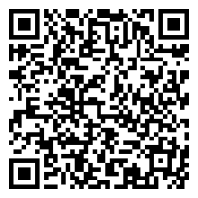

<p align="center"></p>
<h1 align="center">Kumo Bot 雲</h1>
<p align="center"><b>Bot de trading cripto que corre en <i>tu propia nube</i>, con tus reglas.</b><br>
<a href="#-apoya-al-desarrollador">☕ Donar</a> · App Android · Cloudflare Workers · GitHub Actions · IA con Groq · 100+ exchanges vía ccxt</p>

---

## ¿Qué es?

Kumo es un proyecto **abierto y gratuito**. Cada persona instala su propia copia en sus cuentas
gratis de GitHub y Cloudflare: **nadie más ve tus claves ni tu cartera**, ni siquiera quien
mantiene este repositorio.

- **Empieza en simulación**: cartera virtual con precios reales. El dinero real se activa a mano, con doble confirmación.
- **Reglas claras**: reparto objetivo por moneda, compra con RSI bajo, vende con ganancia. Por defecto **nunca vende con pérdida**.
- **IA opcional (Groq)**: puede vetar o confirmar cada operación y analiza monedas en el Radar.
- **Cualquier exchange**: Crypto.com (App y Exchange), Kraken, Coinbase, Bitstamp, MEXC, Gate… y cualquier id de [ccxt](https://github.com/ccxt/ccxt).
- **App con 3 interfaces**: Neón Noche y Neón Día (manga cyberpunk) o Clásica.

## Cómo se instala (desde la app)

1. Instala la APK de [Releases](../../releases) en Android.
2. En la bienvenida elige **Crear mi nube** y sigue el asistente:
   - **GitHub**: token clásico con permisos `repo` y `workflow`.
   - **Cloudflare**: API token con la plantilla **«Edit Cloudflare Workers»**.
   - **Groq** (opcional): clave gratis de console.groq.com.
   - **Exchange**: API key **solo con trading, nunca con retiros** (o empieza sin claves).
3. La app crea `tu-usuario/kumo-nube` (privado) desde esta plantilla, guarda las claves como
   *secretos cifrados* de GitHub, despliega el Worker en tu Cloudflare y lanza el primer ciclo.

## Arquitectura

```
 App Android ──HTTPS + token──▶ Worker en TU Cloudflare (config, estado, IA del Radar, avisos)
                                      ▲
                                      │ reporte de cada ciclo
 GitHub Actions en TU repo privado ───┘  (cada 30 min: lee precios, decide, opera con ccxt)
   └─ secretos cifrados: claves del exchange, Groq, Cloudflare
```

- `runner/`: motor en Python (estrategia, IA, adaptadores de exchange). Pruebas: `python -m unittest discover -s runner/tests`.
- `worker/`: API de la nube (TypeScript, KV). Nunca recibe las claves del exchange.
- `.github/workflows/`: `instalar.yml` (despliega la nube) y `ciclo.yml` (un ciclo cada 30 min).
- `app/android/`: app nativa con WebView (`assets/www/index.html`) y notificaciones nativas.

## Límites del plan gratis

- **GitHub Actions** (repo privado): 2.000 min/mes. Un ciclo cada 30 min usa ~1.440.
- **Cloudflare Workers/KV**: ~50 escrituras al día por usuario, muy por debajo del límite.
- **Binance, Bybit, OKX, KuCoin y Bitget** bloquean los servidores de EE. UU. donde corre GitHub Actions, por eso la app ya no los ofrece.
- **Sin KYC:** Hyperliquid (DEX: te conectas con dirección + clave de una *API wallet* que puede operar pero no retirar; orden mínima 10 USDC) y MEXC (cuenta sin verificar con límite de retiro).

## Seguridad

- Las claves del exchange solo existen como secretos cifrados de **tu** repositorio.
- La app guarda en el teléfono solo la dirección de tu nube, su token y, opcionalmente, el token de GitHub (para «Ciclo ahora»). Puedes borrarlo en Config.
- Crea siempre claves de exchange **sin permiso de retiro**.

## ☕ Apoya al desarrollador

Kumo es gratis y abierto. Si te sirve, puedes invitar un café al desarrollador con una donación voluntaria:

<table>
<tr>
<td align="center" width="50%">
<br><b>Bitcoin (BTC)</b><br><br>
<br>
<sub><code>bc1qd9j45f4t0jwyhjhqh2kvz2cr7k8xye460rr2y7</code></sub>
</td>
<td align="center" width="50%">
<br><b>Monero (XMR)</b><br><br>
<br>
<sub><code>447gTj6Hg6gaAEAUmjqfhqDZr1PziUTvbT4LYLpmLVnTNVFK6cqeqPfh6P4neMKLWX5jDXAr94fWHacJwDvjmCzBBH8wPBt</code></sub>
</td>
</tr>
</table>

Envía solo **BTC por la red Bitcoin** a la dirección de Bitcoin y solo **XMR** a la de Monero. También puedes donar desde la app: **Config → Apoya al desarrollador**.

> ⚠️ El trading de criptomonedas tiene riesgo. Kumo no es asesoría financiera. Usa solo dinero que puedas perder.

Licencia [MIT](LICENSE).
